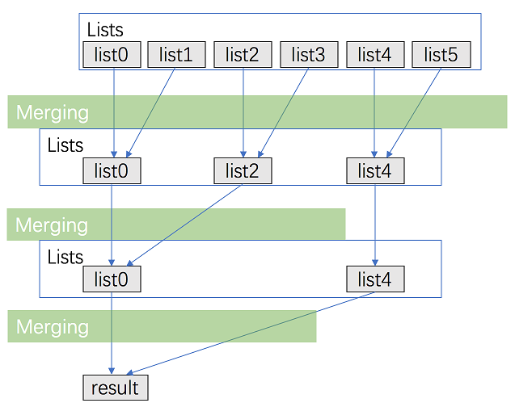

### 题目
给定一个链表数组，每个链表都已经按升序排列。
请将所有链表合并到一个升序链表中，返回合并后的链表。

示例 1：
- 输入：lists = [[1,4,5],[1,3,4],[2,6]]
- 输出：[1,1,2,3,4,4,5,6]
- 解释：链表数组如下：[1->4->5, 1->3->4, 2->6] 将它们合并到一个有序链表中得到。 1->1->2->3->4->4->5->6

示例 2：
- 输入：lists = []
- 输出：[]

示例 3：
- 输入：lists = [[]]
- 输出：[]


提示：
- k == lists.length
- 0 <= k <= 10^4
- 0 <= lists[i].length <= 500
- -10^4 <= lists[i][j] <= 10^4
- lists[i] 按 升序 排列
- lists[i].length 的总和不超过 10^4

### 分治解法

#### 思路
用分治的方法进行合并。
- 将 k 个链表配对并将同一对中的链表合并；
- 第一轮合并以后， k 个链表被合并成了 $\frac{k}{2}$ 链表，平均长度为 $\frac{k}{2n}$
，然后是$\frac{k}{4}$个链表，$\frac{k}{8}$个链表等等；
- 重复这一过程，直到我们得到了最终的有序链表。


#### 代码

```java
class Solution {
    public ListNode mergeKLists(ListNode[] lists) {
        return merge(lists, 0, lists.length - 1);
    }

    public ListNode merge(ListNode[] lists, int l, int r) {
        if (l == r) {
            return lists[l];
        }
        if (l > r) {
            return null;
        }
        int mid = (l + r) >> 1;
        return mergeTwoLists(merge(lists, l, mid), merge(lists, mid + 1, r));
    }

    public ListNode mergeTwoLists(ListNode a, ListNode b) {
        if (a == null || b == null) {
            return a != null ? a : b;
        }
        ListNode head = new ListNode(0);
        ListNode tail = head, aPtr = a, bPtr = b;
        while (aPtr != null && bPtr != null) {
            if (aPtr.val < bPtr.val) {
                tail.next = aPtr;
                aPtr = aPtr.next;
            } else {
                tail.next = bPtr;
                bPtr = bPtr.next;
            }
            tail = tail.next;
        }
        tail.next = (aPtr != null ? aPtr : bPtr);
        return head.next;
    }
}

```

***复杂度分析***
- 时间复杂度：时间复杂度：考虑递归「向上回升」的过程——第一轮合并 $\frac{k}{2}$ 组链表，每一组的时间代价是 $O(2n)$；第二轮合并 $\frac{k}{4}$ 组链表，每一组的时间代价是 $O(4n)$……所以总的时间代价是 $O(\sum_{i = 1}^{\infty} \frac{k}{2^i} \times 2^i n) = O(kn \times \log k)$，故渐进时间复杂度为 $O(kn \times \log k)$。  
- 空间复杂度：递归会使用到 $O(\log k)$空间代价的栈空间

### 优先队列解法

#### 思路
维护当前每个链表没有被合并的元素的最前面一个，k 个链表就最多有 k 个满足这样条件的元素，每次在这些元素里面选取 val 属性最小的元素合并到答案中。在选取最小元素的时候，我们可以用优先队列来优化这个过程。

#### 代码

```java
class Solution {
    class Status implements Comparable<Status> {
        int val;
        ListNode ptr;

        Status(int val, ListNode ptr) {
            this.val = val;
            this.ptr = ptr;
        }

        public int compareTo(Status status2) {
            return this.val - status2.val;
        }
    }

    PriorityQueue<Status> queue = new PriorityQueue<Status>();

    public ListNode mergeKLists(ListNode[] lists) {
        for (ListNode node: lists) {
            if (node != null) {
                queue.offer(new Status(node.val, node));
            }
        }
        ListNode head = new ListNode(0);
        ListNode tail = head;
        while (!queue.isEmpty()) {
            Status f = queue.poll();
            tail.next = f.ptr;
            tail = tail.next;
            if (f.ptr.next != null) {
                queue.offer(new Status(f.ptr.next.val, f.ptr.next));
            }
        }
        return head.next;
    }
}
```

***复杂度分析***
- 时间复杂度：考虑优先队列中的元素不超过 $k$ 个，那么插入和删除的时间代价为 $O(\log k)$，这里最多有 $kn$ 个点，对于每个点都被插入删除各一次，故总的时间代价即渐进时间复杂度为 $O(kn \times \log k)$。
- 空间复杂度：这里用了优先队列，优先队列中的元素不超过 $k$ 个，故渐进空间复杂度为 $O(k)$。